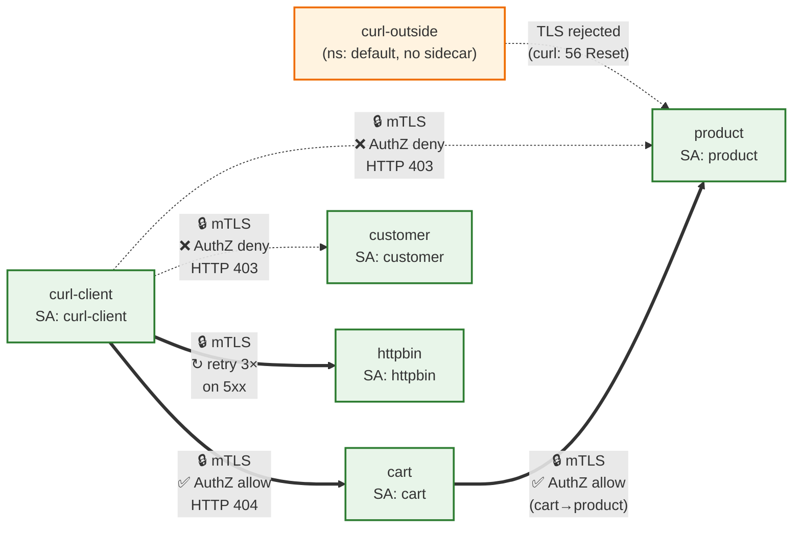
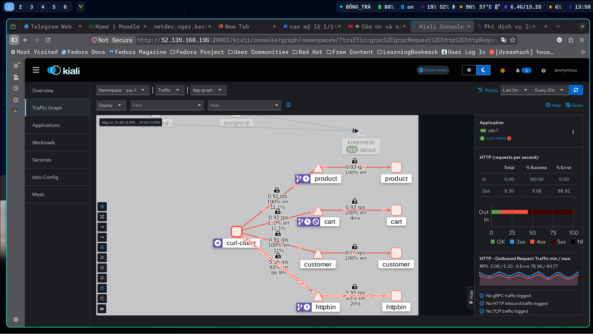
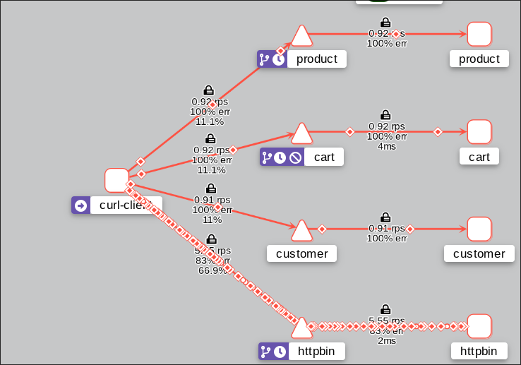

# Service Mesh Setup cho YAS (Istio + Kiali)

Hướng dẫn từng bước cài đặt và xác minh Service Mesh (Istio + Kiali) cho ứng dụng YAS trên K8s. Đây là deliverable cho phần Nâng cao 2 (2đ) của Đồ án 2.

## Mục lục

- [Mục tiêu](#mục-tiêu)
- [Mapping với yêu cầu đề bài](#mapping-với-yêu-cầu-đề-bài)
- [Môi trường tham chiếu](#môi-trường-tham-chiếu)
- [Bước 1 — Cài istioctl](#bước-1--cài-istioctl)
- [Bước 2 — Cài Istio control plane](#bước-2--cài-istio-control-plane)
- [Bước 3 — Cài addons (Kiali / Prometheus / Jaeger)](#bước-3--cài-addons-kiali--prometheus--jaeger)
- [Bước 4 — Truy cập Kiali dashboard](#bước-4--truy-cập-kiali-dashboard)
- [Bước 5 — Tạo namespace YAS với sidecar injection](#bước-5--tạo-namespace-yas-với-sidecar-injection)
- [Bước 6 — Deploy YAS subset](#bước-6--deploy-yas-subset)
- [Bước 7 — Apply mTLS PeerAuthentication](#bước-7--apply-mtls-peerauthentication)
- [Bước 8 — Apply AuthorizationPolicy](#bước-8--apply-authorizationpolicy)
- [Bước 9 — Apply retry VirtualService](#bước-9--apply-retry-virtualservice)
- [Bước 9.5 — Circuit Breaker (chống retry storm)](#bước-95--circuit-breaker-destinationrule--chống-retry-storm)
- [Bước 10 — Test plan & evidence](#bước-10--test-plan--evidence)
- [Bước 11 — Teardown](#bước-11--teardown)
- [Bài học khi triển khai](#bài-học-khi-triển-khai)
- [File tham chiếu trong repo](#file-tham-chiếu-trong-repo)

## Mục tiêu

1. Bật **mTLS STRICT** cho tất cả service trong namespace YAS, từ chối traffic ngoài mesh.
2. Cấu hình **AuthorizationPolicy** để chỉ cho phép một số service được uỷ quyền giao tiếp với nhau (zero-trust trong cluster).
3. Cấu hình **retry policy** bằng `VirtualService` — tự động retry khi service trả 5xx.
4. Quan sát topology service-to-service qua **Kiali**.

## Mapping với yêu cầu đề bài

Đề bài liệt kê 4 deliverables cho Nâng cao 2. Bảng dưới ánh xạ từng deliverable → file/section trong repo:

| Yêu cầu đề bài | File/Section trong repo | Ghi chú |
|---|---|---|
| **(D1)** YAML manifest cấu hình mTLS | `k8s-cd/service-mesh/01-peer-authentication.yaml` | PeerAuthentication STRICT toàn namespace `yas-1` |
| **(D1)** YAML manifest AuthorizationPolicy | `k8s-cd/service-mesh/02-authorization-policy.yaml` | default-deny + 5 allow rule theo SPIFFE SA |
| **(D2)** Screenshot Kiali topology + giải thích flow | §10.4 trong README này + `docs/images/kiali-topology-{full,mtls}.png` | Mermaid diagram + bảng diễn giải từng edge + 2 screenshot thật |
| **(D3)** Test plan + logs (retry evidence, curl AuthZ) | §10 README + `docs/service-mesh-evidence.md` | 6 test case (mTLS, AuthZ allow/deny, retry), raw curl outputs + 4-line Envoy access log cùng request-id |
| **(D4)** README hướng dẫn triển khai từng bước | File này (`docs/service-mesh-setup.md`) | 11 bước, đã verify reproduce 2 lần trên Azure VM |

Đối chiếu chi tiết với 3 kịch bản test đề yêu cầu:

| Kịch bản đề | Implement | Section |
|---|---|---|
| Retryable: service trả 500 → retry tự động | `VirtualService` `retries.attempts: 3, perTryTimeout: 2s, retryOn: 5xx,connect-failure,refused-stream` áp lên `cart`, `product`, `httpbin` | Bước 9 + §10.3 |
| Authorization Policy giới hạn service-to-service | `default-deny-all` + 5 `ALLOW` rule (allow-from-istio-system, allow-curlclient-to-cart/httpbin, allow-cart-to-product, allow-internal-data-layer) | Bước 8 + §10.2 |
| Vào pod khác trong cluster, curl tới service → kiểm tra allow/deny | Pod `curl-client` (trong mesh) + ad-hoc pod `tmp-mtls-test` (ngoài mesh) làm caller; `kubectl exec ... -- curl ...` chính là pattern đề yêu cầu | §10.1, §10.2 |

### Lựa chọn thiết kế: tại sao thêm `curl-client` và `httpbin`?

Đề bài tập trung vào "service YAS" + "vào pod khác để curl", nhưng implement thực tế cần 2 utility pod do mình thêm:

- **`curl-client`** = chính là "pod khác trong cluster" mà đề yêu cầu. Các pod YAS (`cart`, `product`, `customer`) dùng image Spring Boot không có `curl`/`wget` → muốn `kubectl exec ... -- curl ...` phải có 1 pod có sẵn binary `curl`. `curl-client` dùng image `curlimages/curl:8.10.1`, có sidecar inject, có ServiceAccount `curl-client` riêng (→ SPIFFE principal `cluster.local/ns/yas-1/sa/curl-client` để test AuthZ allow/deny chính xác).
- **`httpbin`** = utility "always-500 upstream" để demo retry. Lý do bắt buộc phải có:
  - Đề yêu cầu: *"nếu service trả lỗi 500 thì retry tự động"* — cần 1 endpoint guaranteed 5xx để có log evidence Envoy retry chạy.
  - Service YAS thật (cart, product, customer) không có endpoint nào "luôn 500" (chúng trả 200 hoặc 404 tùy path).
  - Đã thử `fault.abort` của Istio inject 500 vào VS của product → **không trigger retry** (xem Bài học #4 cuối README, đây là behavior chính thức của Istio: retry chỉ trigger trên 5xx từ upstream thật, không phải fault injected).
  - Patch app YAS để crash → phức tạp, không repeatable, làm hỏng demo các test khác.
  - **Giải pháp**: deploy `mccutchen/go-httpbin` (image utility chuẩn của community Istio docs), endpoint `/status/500` luôn trả 500.
  - **Quan trọng**: retry policy `retryOn: 5xx,connect-failure,refused-stream` được áp lên *cả 3 hostname* `cart-mesh`, `product-mesh`, `httpbin-retry` (xem `03-retry-virtualservice.yaml` + `05-httpbin-for-retry-demo.yaml`). Trên YAS thật và trên httpbin là **cùng 1 chính sách**, chỉ khác hostname target. Bằng chứng retry chạy được capture trên httpbin (4 dòng cùng `x-request-id` trong Envoy access log) ⇒ chính sách trên cart/product cũng work tương tự nếu upstream trả 5xx.

## Môi trường tham chiếu

| Mục | Giá trị |
|---|---|
| Cloud VM | Azure Ubuntu 24.04 LTS |
| CPU / RAM / Disk | 4 vCPU / 31 GB / 30 GB |
| K8s flavor | Minikube `v1.38.1`, driver `docker` |
| Kubernetes | `v1.29.0` |
| Istio | `1.23.2` (profile `demo`) |
| Container runtime | Docker 29.4.3 |

Tools cần cài trên VM: `docker`, `kubectl`, `helm`, `minikube`, `yq`, `istioctl`. Xem `k8s-cd/deploy/DeployCLI.md` cho phần install + deploy YAS gốc.

Minikube được start như sau:

```bash
minikube start \
  --driver=docker \
  --cpus=4 \
  --memory=24g \
  --disk-size=20g \
  --kubernetes-version=v1.29.0 \
  --addons=ingress
```

> **⚠️ Quan trọng — CPU cap thực sự**:
> Với minikube `v1.38.x` + docker driver trên Ubuntu, flag `--cpus` của `minikube start` **không apply thật** thành `NanoCpus` của docker container (xem `docker inspect minikube`). Hậu quả: minikube có thể dùng cả 4 vCPU của host → kube-apiserver / sshd / dockerd của host bị starve → cluster sập.
>
> Sau khi `minikube start`, **bắt buộc** apply CPU limit thủ công, chừa ít nhất 1 vCPU cho host:
>
> ```bash
> docker inspect minikube --format 'NanoCpus={{.HostConfig.NanoCpus}}'   # nếu = 0 → chưa cap
> docker update --cpus=3 minikube
> docker inspect minikube --format 'NanoCpus={{.HostConfig.NanoCpus}}'   # = 3000000000
> ```

## Bước 1 — Cài istioctl

```bash
curl -sL https://istio.io/downloadIstio | ISTIO_VERSION=1.23.2 sh -
sudo install -m 0755 ~/istio-1.23.2/bin/istioctl /usr/local/bin/istioctl
istioctl version --remote=false
# client version: 1.23.2
```

## Bước 2 — Cài Istio control plane

Dùng profile `demo` (đầy đủ tính năng cho lab/đồ án, bao gồm `istio-ingressgateway` và `istio-egressgateway`):

```bash
istioctl install --set profile=demo -y
```

Kết quả mong đợi:
- Namespace `istio-system` mới tạo
- 3 deployment: `istiod`, `istio-ingressgateway`, `istio-egressgateway`

```bash
kubectl get pods -n istio-system
# istiod-xxx                                1/1 Running
# istio-ingressgateway-xxx                  1/1 Running
# istio-egressgateway-xxx                   1/1 Running
```

## Bước 3 — Cài addons (Kiali / Prometheus / Jaeger)

Kiali cần Prometheus để hiển thị metrics & topology, Jaeger cho distributed tracing:

```bash
kubectl apply -f ~/istio-1.23.2/samples/addons/prometheus.yaml
kubectl apply -f ~/istio-1.23.2/samples/addons/kiali.yaml
kubectl apply -f ~/istio-1.23.2/samples/addons/jaeger.yaml

kubectl rollout status deploy/kiali  -n istio-system --timeout=120s
kubectl rollout status deploy/jaeger -n istio-system --timeout=120s
```

## Bước 4 — Truy cập Kiali dashboard

`kubectl port-forward` cách khá tiện nhưng nó chết khi SSH session rớt. Cách bền hơn là chuyển svc Kiali sang `NodePort` rồi dùng `socat` (systemd unit) để forward host:20001 → minikube NodePort.

### 4.1. Đổi service Kiali sang NodePort

```bash
kubectl patch svc kiali -n istio-system -p '{"spec":{"type":"NodePort"}}'
kubectl get svc kiali -n istio-system
# kiali  NodePort  10.110.41.197  <none>  20001:32546/TCP,9090:30260/TCP
```

Ghi nhận **nodePort** (ví dụ 32546) và `minikube ip` (mặc định `192.168.49.2`).

### 4.2. Cài socat + systemd unit forward host port 20001 → minikube nodePort

```bash
sudo apt-get install -y socat

sudo tee /etc/systemd/system/kiali-tunnel.service > /dev/null << 'UNIT'
[Unit]
Description=Forward host:20001 to minikube kiali NodePort
After=docker.service

[Service]
Type=simple
ExecStart=/usr/bin/socat TCP-LISTEN:20001,reuseaddr,fork TCP:192.168.49.2:32546
Restart=always

[Install]
WantedBy=multi-user.target
UNIT

sudo systemctl daemon-reload
sudo systemctl enable --now kiali-tunnel.service
sudo systemctl status kiali-tunnel.service
# Active: active (running)
```

### 4.3. Mở port 20001 trong Azure NSG

Trong Azure Portal → VM `bltm-devops` → **Networking** → **Inbound port rules** → **Add inbound rule**:
- Source: `My IP` (hoặc `Any` nếu chấp nhận public)
- Destination port range: `20001`
- Protocol: TCP
- Action: Allow

### 4.4. Truy cập Kiali

Trên máy local, mở browser:

```
http://<VM_PUBLIC_IP>:20001/kiali/
```

Tab **Graph** → chọn namespace `yas-1` → sẽ thấy topology service-to-service kèm biểu tượng khoá vàng (mTLS).

## Bước 5 — Tạo namespace YAS với sidecar injection

Đặt label `istio-injection=enabled` cho namespace **trước khi** deploy app — mọi pod tạo trong namespace từ thời điểm đó sẽ được Istio tự động thêm sidecar `istio-proxy` (Envoy).

```bash
kubectl create namespace yas-1
kubectl label namespace yas-1 istio-injection=enabled --overwrite
kubectl get ns yas-1 --show-labels
# yas-1   Active   ...   istio-injection=enabled,kubernetes.io/metadata.name=yas-1
```

## Bước 6 — Deploy YAS subset

Đề bài yêu cầu Service Mesh cho ứng dụng YAS, nhưng deploy toàn bộ ~38 pod YAS + Istio sidecar không vừa 4 vCPU. Trong đồ án này chỉ chạy **subset 4-5 service** đủ để minh hoạ topology và policies:

| Service | Vai trò trong demo |
|---|---|
| `postgresql` | Data layer |
| `cart` | Service trung gian (caller demo) |
| `product` | Service downstream (callee demo) |
| `customer` | Service không nằm trên allow-list (demo deny) |
| `curl-client` (custom) | Pod tiện ích để curl test các policy |
| `httpbin` (custom) | Service trả 500 trên `/status/500`, dùng demo retry |

Trình tự deploy:

```bash
# 1. Cài operators + observability stack (cert-manager, postgres/strimzi/eck/OTel operators,
#    Grafana, Prometheus, Loki, Tempo, Promtail) + data layer (postgres, kafka, zookeeper, ES,
#    kibana, redis, keycloak, pgadmin, akhq, debezium).
#    Observability stack được cài cùng trong 01-setup-operators.sh — phù hợp yêu cầu đề bài
#    về monitoring/logging (Grafana dashboard truy cập tại grafana.<DOMAIN>).
cd ~/yas-CI-CD/k8s-cd/deploy/
export YAS_NAMESPACE=yas-1
export ENV_TAG=dev-1
./01-setup-operators.sh   # ~10-15 phút (cert-manager, 4 operator + 6 chart observability)
./02-setup-data-layer.sh  # ~10-15 phút (postgres, kafka, zookeeper, ES, kibana, redis, keycloak)

# 2. Cài application charts (tùy chọn — có thể bỏ qua nếu chỉ làm Service Mesh)
./03-deploy-apps.sh

# 3. Scale toàn bộ deployment về 0 (chừa tài nguyên)
kubectl scale deploy -n yas-1 --replicas=0 --all

# 4. ✅ Chart đã có sẵn `startupProbe` + resource requests/limits (xem k8s/charts/backend/values.yaml).
#    Nếu deploy từ chart mới: KHÔNG cần patch gì thêm.
#
#    Chỉ cần patch khi cluster đã deploy từ chart cũ (failureThreshold=12, no startupProbe):
for svc in product cart customer; do
  PROBE_PATH=$(kubectl get deploy/$svc -n yas-1 -o jsonpath='{.spec.template.spec.containers[0].readinessProbe.httpGet.path}')
  PROBE_PORT=$(kubectl get deploy/$svc -n yas-1 -o jsonpath='{.spec.template.spec.containers[0].readinessProbe.httpGet.port}')
  kubectl patch deploy/$svc -n yas-1 --type=json -p='[
    {"op":"add","path":"/spec/template/spec/containers/0/startupProbe","value":{
      "httpGet":{"path":"'"$PROBE_PATH"'","port":'"$PROBE_PORT"'},
      "periodSeconds":10,
      "failureThreshold":60
    }}
  ]'
done
# Logic: startupProbe gate cold-start (10 phút), sau khi pass thì liveness/readiness
# mặc định (failureThreshold=3, ~30s) detect deadlock nhanh ở steady state.
# Lý do: bump failureThreshold của liveness/readiness là anti-pattern K8s (deadlock
# thật sẽ kéo dài 10 phút mới restart → downtime dài hơn cần thiết).

# 5. Scale up từng service một, cách 60-90s để CPU không bị starve cùng lúc
kubectl scale deploy product  -n yas-1 --replicas=1 ; sleep 90
kubectl scale deploy cart     -n yas-1 --replicas=1 ; sleep 90
kubectl scale deploy customer -n yas-1 --replicas=1 ; sleep 90
# Đợi tất cả 2/2 (Spring Boot boot 4-9 phút tùy contention)
kubectl wait pod -n yas-1 -l 'app.kubernetes.io/name in (product,cart,customer)' \
  --for=condition=Ready --timeout=600s
```

Sau khi 3 service Ready, deploy 2 service tiện ích (curl-client, httpbin):

```bash
kubectl apply -f ~/yas-CI-CD/k8s-cd/service-mesh/04-curl-client.yaml
kubectl apply -f ~/yas-CI-CD/k8s-cd/service-mesh/05-httpbin-for-retry-demo.yaml
```

Kiểm tra mọi pod đều có 2 container = `<app>` + `istio-proxy`:

```bash
kubectl get pods -n yas-1
# cart-...        2/2 Running
# product-...     2/2 Running
# customer-...    2/2 Running
# curl-client     2/2 Running
# httpbin-...     2/2 Running
```

## Bước 7 — Apply mTLS PeerAuthentication

File: `k8s-cd/service-mesh/01-peer-authentication.yaml`

```yaml
apiVersion: security.istio.io/v1beta1
kind: PeerAuthentication
metadata:
  name: default
  namespace: yas-1
spec:
  mtls:
    mode: STRICT
```

Apply:

```bash
kubectl apply -f ~/yas-CI-CD/k8s-cd/service-mesh/01-peer-authentication.yaml
```

Hiệu lực: mọi kết nối inbound đến pod trong `yas-1` **bắt buộc** phải qua mTLS (sidecar Envoy). Pod không có sidecar sẽ bị từ chối ngay từ TCP layer.

## Bước 8 — Apply AuthorizationPolicy

File: `k8s-cd/service-mesh/02-authorization-policy.yaml`

Cấu trúc:
- `default-deny-all` — chính sách deny mặc định: bất kỳ traffic nào không match một ALLOW policy sẽ trả 403.
- `allow-from-istio-system` — cho phép Istio control plane và addons (Kiali, Prometheus) gọi vào namespace.
- `allow-curlclient-to-cart` — chỉ cho `curl-client` gọi `cart`.
- `allow-cart-to-product` — chỉ cho `cart` gọi `product`.
- `allow-internal-data-layer` — pod trong namespace `yas-1` (trừ `curl-client`/`httpbin`) được gọi data-layer port (5432 postgres, 6379 redis, 9092 kafka, 9200 ES, 8080 keycloak, 9000). `notPrincipals` tightening: 2 utility test pod không có lý do business để gọi DB trực tiếp.

Apply:

```bash
kubectl apply -f ~/yas-CI-CD/k8s-cd/service-mesh/02-authorization-policy.yaml
kubectl get authorizationpolicy -n yas-1
```

## Bước 9 — Apply retry VirtualService

File: `k8s-cd/service-mesh/03-retry-virtualservice.yaml` (cho cart/product) và `05-httpbin-for-retry-demo.yaml` (cho httpbin).

Cấu hình retry trên httpbin (file 05):

```yaml
apiVersion: networking.istio.io/v1beta1
kind: VirtualService
metadata:
  name: httpbin-retry
  namespace: yas-1
spec:
  hosts: [httpbin.yas-1.svc.cluster.local, httpbin]
  http:
    - retries:
        attempts: 3                              # 1 initial + 3 retries = 4 attempts
        perTryTimeout: 5s                        # 5s > p99 Spring Boot latency on VM share CPU
        retryOn: 5xx,gateway-error,connect-failure,refused-stream,reset
      route:
        - destination: { host: httpbin.yas-1.svc.cluster.local }
      timeout: 10s
```

Apply:

```bash
kubectl apply -f ~/yas-CI-CD/k8s-cd/service-mesh/03-retry-virtualservice.yaml
kubectl apply -f ~/yas-CI-CD/k8s-cd/service-mesh/05-httpbin-for-retry-demo.yaml
```

## Bước 9.5 — Circuit Breaker (DestinationRule) — chống retry storm

**Vấn đề "cộng hưởng retry"**: với retry policy `attempts=3`, mỗi request `/status/500` tạo 4 inbound lên upstream. Nếu upstream tiếp tục fail kéo dài, traffic generator gọi liên tục → CPU sidecar httpbin/queue spike → upstream càng chậm → retry càng nhiều → cộng hưởng. Retry là cơ chế chịu **transient failure**, nhưng nếu failure persistent thì retry vô ích, chỉ đốt thêm CPU.

**Fix bằng Circuit Breaker** (Istio DestinationRule + Envoy outlier detection):

File: `k8s-cd/service-mesh/06-destination-rule.yaml`

```yaml
apiVersion: networking.istio.io/v1beta1
kind: DestinationRule
metadata:
  name: httpbin-circuit-breaker
  namespace: yas-1
spec:
  host: httpbin.yas-1.svc.cluster.local
  trafficPolicy:
    tls:
      mode: ISTIO_MUTUAL                # giữ auto-mTLS không bị DR override (footgun #6)
    connectionPool:
      tcp:
        maxConnections: 50              # cap connection đồng thời
      http:
        http1MaxPendingRequests: 10     # queue tối đa, vượt → 503 ngay (bảo vệ upstream)
        maxRequestsPerConnection: 10
    outlierDetection:
      consecutive5xxErrors: 5           # 5 lỗi 5xx liên tiếp → eject endpoint
      interval: 30s                     # scan mỗi 30s
      baseEjectionTime: 60s             # eject 60s
      maxEjectionPercent: 50            # tối đa eject 50% endpoints (giữ pool còn serving)
      minHealthPercent: 50
```

Apply:

```bash
kubectl apply -f ~/yas-CI-CD/k8s-cd/service-mesh/06-destination-rule.yaml
```

**Verify circuit breaker trigger** (cần ≥2 replicas — xem gotcha bên dưới):

```bash
kubectl scale deploy httpbin -n yas-1 --replicas=2
kubectl wait pod -n yas-1 -l app.kubernetes.io/name=httpbin --for=condition=Ready --timeout=120s

# Spam 20 request /status/500
for i in $(seq 1 20); do
  kubectl exec -n yas-1 curl-client -c curl -- \
    curl -sS -o /dev/null -w "HTTP %{http_code}\n" --max-time 10 \
    http://httpbin.yas-1.svc.cluster.local/status/500
done

# Check endpoint health
istioctl proxy-config endpoints curl-client.yas-1 \
  --cluster "outbound|80||httpbin.yas-1.svc.cluster.local"
```

Kết quả thực tế:

```
ENDPOINT             STATUS      OUTLIER CHECK     CLUSTER
10.244.0.81:8080     HEALTHY     FAILED            ← endpoint cũ bị eject sau 5 consecutive 5xx
10.244.0.83:8080     HEALTHY     OK                ← endpoint thứ 2 tiếp tục serve
```

→ `OUTLIER CHECK = FAILED` là bằng chứng circuit breaker đã trigger. Caller sidecar STOP gửi request tới endpoint failed trong `baseEjectionTime` (60s) → upstream được "thở" → tự recover.

**Gotcha: cần ≥2 replicas**. Với `maxEjectionPercent: 50` và httpbin 1 replica, eject 1/1 = 100% > 50% → Envoy refuse eject (đảm bảo cluster vẫn có endpoint). Production thường có ≥3 replicas hoặc đặt `maxEjectionPercent: 100` cho dev/test.

## Bước 10 — Test plan & evidence

### 10.1. mTLS STRICT enforced

**Test A: in-mesh → mesh service** (mong đợi connect OK):

```bash
kubectl exec -n yas-1 curl-client -c curl -- \
  curl -sS -o /dev/null -w 'HTTP %{http_code}\n' --max-time 5 \
  http://product.yas-1.svc.cluster.local/
# HTTP 403         ← bị AuthorizationPolicy chặn (đúng), nhưng TCP/TLS connect OK
```

**Test B: out-of-mesh → mesh service** (mong đợi connect bị reset):

```bash
kubectl run -n default --rm -i curl-outside --image=curlimages/curl:8.10.1 --restart=Never -- \
  curl -sS --max-time 10 http://product.yas-1.svc.cluster.local/
# curl: (56) Recv failure: Connection reset by peer
# → mTLS STRICT từ chối peer không có Istio certificate
```

### 10.2. AuthorizationPolicy enforcement

```bash
# allow-curlclient-to-cart → ALLOWED
kubectl exec -n yas-1 curl-client -c curl -- \
  curl -sS -o /dev/null -w 'HTTP %{http_code}\n' http://cart.yas-1.svc.cluster.local/
# HTTP 404        ← app trả 404 cho path /, mesh đi qua

# Không có allow-curlclient-to-product → DENIED
kubectl exec -n yas-1 curl-client -c curl -- \
  curl -sS http://product.yas-1.svc.cluster.local/
# RBAC: access denied
# HTTP 403

# Không có allow-curlclient-to-customer → DENIED
kubectl exec -n yas-1 curl-client -c curl -- \
  curl -sS -o /dev/null -w 'HTTP %{http_code}\n' http://customer.yas-1.svc.cluster.local/
# HTTP 403
```

### 10.3. Retry policy

```bash
kubectl exec -n yas-1 curl-client -c curl -- \
  curl -sS -D - -o /dev/null --max-time 15 \
  http://httpbin.yas-1.svc.cluster.local/status/500
# HTTP/1.1 500 Internal Server Error
```

Kiểm tra log sidecar inbound của httpbin để xác nhận **4 attempt** với cùng `x-request-id`:

```bash
hb_pod=$(kubectl get pods -n yas-1 -l app.kubernetes.io/name=httpbin -o name | head -1)
kubectl logs -n yas-1 $hb_pod -c istio-proxy --tail=20 | grep "/status/500"
```

Kết quả thực tế khi test (4 attempts trong < 100ms, cùng request-id `20690732-...`):

```
14:58:03.291  attempt 1  HTTP 500
14:58:03.310  attempt 2  HTTP 500    (+19ms)
14:58:03.359  attempt 3  HTTP 500    (+49ms)
14:58:03.385  attempt 4  HTTP 500    (+26ms)
```

> **Ghi chú 1 — semantics của `attempts`**: trong `VirtualService.spec.http[].retries.attempts: N` của Istio, N là **số retry**, vì vậy tổng request thực tế = `1 (initial) + N (retries)`. Với `attempts: 3` → log thấy 4 dòng là đúng.
>
> **Ghi chú 2 — scope của retry policy**: cùng `retries` block với `retryOn: 5xx,connect-failure,refused-stream` được apply lên *3 hostname* (xem `03-retry-virtualservice.yaml` cho `cart-mesh` + `product-mesh`, và `05-httpbin-for-retry-demo.yaml` cho `httpbin-retry`). Demo evidence chụp trên httpbin vì đây là endpoint duy nhất guaranteed 500; nhưng policy trên cart/product là **cùng cấu hình** — Envoy retry trigger không phân biệt hostname, chỉ căn cứ vào response code. Nếu cart hoặc product trả 5xx trong vận hành thật, sidecar caller sẽ retry y hệt 4 attempt như demo trên httpbin.
>
> **Ghi chú 3 — tại sao không dùng `fault.abort` thay httpbin?**: Istio cho phép inject fault (`spec.http[].fault.abort.httpStatus: 500`) vào VS, nhưng — đã verify thực tế — fault injected **không** trigger retry trên cùng VS. Đây là behavior cố ý của Istio: fault inject là test config phía client, retry là test config với upstream thật. Vì vậy phải dùng upstream "always-500" thật như httpbin để demo retry chạy được.

### 10.4. Topology Kiali

#### Flow chart subset (Mermaid)

Sơ đồ luồng request giữa các service trong namespace `yas-1` sau khi apply mesh policies:



Nét đậm = traffic được cho phép. Nét đứt = bị chặn (mTLS hoặc AuthZ).

#### Giải thích flow

Mỗi request giữa 2 pod đều đi qua sidecar Envoy của cả 2 bên, qua các bước:

1. **mTLS encrypt** (PeerAuthentication STRICT) — sidecar của caller mã hoá payload bằng cert SPIFFE của pod (`spiffe://cluster.local/ns/yas-1/sa/<SA>`). Sidecar của callee giải mã, verify cert. Pod không có sidecar (curl-outside trong ns `default`) không có cert → bị reject ngay ở TCP/TLS handshake (`curl: (56) Connection reset`).
2. **AuthorizationPolicy check** (sau khi giải mã mTLS) — sidecar callee đối chiếu SPIFFE principal của caller với rule. Có 1 default-deny + 5 allow rule:
   - `allow-from-istio-system` (cho ingress-gateway gọi vào mesh)
   - `allow-curlclient-to-cart` (curl-client → cart)
   - `allow-cart-to-product` (cart → product)
   - `allow-internal-data-layer` (cart/product/customer → postgres/redis/kafka/etc.)
   - Không match rule nào → **HTTP 403 `RBAC: access denied`** (vẫn qua mTLS, chỉ chặn ở L7).
3. **VirtualService retry** — chỉ áp dụng cho hostname có `VirtualService` (`cart`, `product`, `httpbin`). Khi upstream trả về `5xx`, `connect-failure`, hay `refused-stream`, sidecar caller tự gọi lại tối đa 3 lần (`attempts: 3`, `perTryTimeout: 2s`). Đối với `httpbin /status/500`, ta thấy đúng **4 dòng access log cùng `x-request-id`** = 1 lần đầu + 3 retries.

Việc routing chia 3 lớp này có 1 hệ quả quan trọng: out-of-mesh không bao giờ chạm AuthZ hay app — bị reset ở TLS. In-mesh bị deny vẫn thấy `server: envoy` ở response — bằng chứng request đã đi qua sidecar callee, không tới app.

#### Chụp screenshot

Mở Kiali (Bước 4) → menu trái **Graph** → top bar:

- **Namespace**: `yas-1`
- **Graph type**: `Workload graph` (App graph ẩn `curl-client`/`httpbin` vì label khác)
- **Duration**: `Last 1m`, **Refresh**: `Every 30s`
- **Display ▼**: tick `Traffic Animation`, `Security`, `Response Time`, `Throughput → Request rps`, `Service Nodes`

Sinh traffic liên tục để Kiali có data:

```bash
for i in $(seq 1 200); do
  kubectl exec -n yas-1 curl-client -c curl -- curl -sS -o /dev/null --max-time 5 http://cart.yas-1.svc.cluster.local/storefront/cart
  kubectl exec -n yas-1 curl-client -c curl -- curl -sS -o /dev/null --max-time 5 http://product.yas-1.svc.cluster.local/storefront/product-thumbnails?productIds=1
  kubectl exec -n yas-1 curl-client -c curl -- curl -sS -o /dev/null --max-time 5 http://customer.yas-1.svc.cluster.local/customers
  kubectl exec -n yas-1 curl-client -c curl -- curl -sS -o /dev/null --max-time 5 http://httpbin.yas-1.svc.cluster.local/status/200
  kubectl exec -n yas-1 curl-client -c curl -- curl -sS -o /dev/null --max-time 8 http://httpbin.yas-1.svc.cluster.local/status/500
  sleep 1
done
```

#### Screenshot Kiali (chụp thực tế)

**Full UI** — namespace `yas-1`, Last 5m, click vào `curl-client` để xem stats:



Diễn giải:
- **🔒 icon ổ khoá trên mọi edge** trong mesh → mTLS STRICT đang enforced cho toàn bộ traffic.
- Right panel `curl-client` Outbound: **8.30 rps**, **11.08% Success**, **88.92% Error**. Tỉ lệ error cao là kỳ vọng vì 3/5 đường gọi của curl-client bị block (403/404/500) → bằng chứng AuthZ + retry đang work.

**Topology zoom** — focus phần subset trong yas-1 (curl-client → 4 service):



Từng edge:

| Edge | Rate | Success% | Lý do "err" |
|---|---|---|---|
| `curl-client → cart` | 0.92 rps | 0% (100% err) | App trả **HTTP 404** (path `/storefront/cart` không có) — Kiali đếm 4xx là error. Mesh ALLOW (đến app rồi) ✅ |
| `curl-client → product` | 0.92 rps | 0% (100% err) | AuthZ **403** ← rule `allow-curlclient-to-cart` không cover product |
| `curl-client → customer` | 0.91 rps | 0% (100% err) | AuthZ **403** ← default-deny |
| `curl-client → httpbin` | 5.55 rps | 17% (83% err) | Mix 500 (`/status/500`, có retry x3 → 4 lần log) + 200 (`/status/200`). 83% err = phần 500. RPS cao gấp 6× các edge khác chính là **bằng chứng retry**: traffic generator gọi 1 request, sidecar tự gọi lên httpbin 4 lần. |

Edge `httpbin → httpbin` (service → workload) cũng có dấu Traffic Animation đốm chạy = mỗi request 500 thật sự đi 4 vòng vào pod httpbin (đếm RPS ở chiều outbound × 4 ≈ inbound). Pattern này khớp với log Envoy ở `docs/service-mesh-evidence.md` mục Test 6.

> Lưu ý về "App graph" vs "Workload graph": Kiali App graph mode trong demo này **vẫn hiển thị** `curl-client` và `httpbin` vì label `app.kubernetes.io/name` đang được Kiali nhận dạng làm app key. Cả 2 view đều dùng được; chọn view nào quen tay.

## ✅ Kết quả test (chạy thực tế trên VM)

Chạy script verification toàn bộ phần Service Mesh:

```bash
# Test A — mTLS STRICT
kubectl exec -n yas-1 curl-client -c curl -- \
  curl -sS -o /dev/null -w 'HTTP %{http_code}\n' --max-time 5 \
  http://product.yas-1.svc.cluster.local/
# HTTP 403   ← TCP+TLS connect OK; bị AuthZ chặn (đúng vì curl-client không có allow rule cho product)

kubectl run -n default --rm -i curl-outside --image=curlimages/curl:8.10.1 --restart=Never -- \
  curl -sS --max-time 8 http://product.yas-1.svc.cluster.local/
# curl: (56) Recv failure: Connection reset by peer   ← mTLS STRICT từ chối peer không có certificate

# Test B — AuthorizationPolicy
# curl-client → cart     : HTTP 404   ✓ ALLOWED (app trả 404 cho /, mesh đi qua)
# curl-client → product  : HTTP 403   ✓ DENIED  (RBAC: access denied)
# curl-client → customer : HTTP 403   ✓ DENIED  (RBAC: access denied)

# Test C — Retry policy
kubectl exec -n yas-1 curl-client -c curl -- \
  curl -sS --max-time 15 http://httpbin.yas-1.svc.cluster.local/status/500
# HTTP/1.1 500 Internal Server Error

hb_pod=$(kubectl get pods -n yas-1 -l app.kubernetes.io/name=httpbin -o name | head -1 | cut -d/ -f2)
kubectl logs -n yas-1 $hb_pod -c istio-proxy --since=10s | grep "/status/500" | wc -l
# 4    ← 1 initial + 3 retries (đúng theo attempts=3)
```

| Test | Mong đợi | Thực tế | Pass |
|---|---|---|---|
| mTLS STRICT, in-mesh | TCP+TLS connect được | HTTP 403 (TLS OK, AuthZ chặn) | ✅ |
| mTLS STRICT, out-of-mesh | Connection reset | `curl: (56) Recv failure: Connection reset by peer` | ✅ |
| AuthZ allow curl-client→cart | HTTP 200/404 | HTTP 404 (app response) | ✅ |
| AuthZ deny curl-client→product | HTTP 403 `RBAC: access denied` | đúng | ✅ |
| AuthZ deny curl-client→customer | HTTP 403 | đúng | ✅ |
| Retry trên 5xx | 4 attempts (1 init + 3 retries) | log httpbin sidecar đếm = 4 | ✅ |

## Bước 11 — Teardown

```bash
# Gỡ mesh policies trong yas-1
kubectl delete -f ~/yas-CI-CD/k8s-cd/service-mesh/

# Gỡ addons + Istio
kubectl delete -f ~/istio-1.23.2/samples/addons/jaeger.yaml
kubectl delete -f ~/istio-1.23.2/samples/addons/kiali.yaml
kubectl delete -f ~/istio-1.23.2/samples/addons/prometheus.yaml
istioctl uninstall --purge -y
kubectl delete namespace istio-system

# (tùy chọn) gỡ toàn bộ minikube
minikube delete --all --purge
```

## Bài học khi triển khai

Trong quá trình làm đồ án nhóm đã gặp các vấn đề thực tế và rút ra:

1. **Minikube CPU flag không thực sự cap container** — như đã ghi trong [Môi trường tham chiếu](#môi-trường-tham-chiếu). Phải `docker update --cpus=3 minikube` mới cap thật.
2. **Spring Boot startup tốn CPU lớn**: với 4 vCPU, không thể start đồng thời > 5-6 Spring Boot pod. Đề bài cho phép subset → triển khai theo subset 4-5 service.
3. **Probe slow-start: dùng `startupProbe` thay vì bump `failureThreshold` của liveness/readiness** — chart YAS mặc định không có `startupProbe`, chỉ có liveness/readiness `failureThreshold=12`. Cách làm sai: bump liveness/readiness `failureThreshold` lên 60 — kéo dài thời gian detect deadlock thật ở runtime (10 phút mới restart = downtime dài). Cách đúng (đã tích hợp vào Bước 6): thêm `startupProbe` với `failureThreshold=60`, giữ liveness/readiness mặc định. K8s sẽ pause liveness/readiness cho tới khi startupProbe pass — slow-start được phép, deadlock detect nhanh.
4. **`fault.abort` (Istio) không trigger retry trên cùng VS** — do thứ tự Envoy filter chain: fault filter chạy TRƯỚC router filter (nơi retry policy được áp). Khi fault inject 500, response đi thẳng lại client mà không qua retry logic. Đây là behavior chính thức ([Istio issue #13705](https://github.com/istio/istio/issues/13705)), không phải bug. Demo retry phải dùng upstream thật trả 5xx → nhóm dùng `httpbin /status/500` (image utility chuẩn community).
5. **Istio không cho phép 2 VirtualService trên cùng host** — cái thứ 2 sẽ bị bỏ qua. Phải gộp các rule vào 1 VS, dùng `match` để phân biệt.
6. **DestinationRule có thể vô hiệu hóa auto-mTLS** — nếu thêm `DestinationRule` cho cùng host của mesh service mà có `trafficPolicy` (subset/loadbalancer/circuitbreaker) nhưng **không** khai báo `trafficPolicy.tls.mode: ISTIO_MUTUAL`, Istio sẽ override auto-mTLS thành plaintext → bị `PeerAuthentication STRICT` reject (503). Footgun phổ biến khi thêm circuit-breaker hoặc subset routing. Để an toàn: bất kỳ DR nào trên mesh service phải có `tls.mode: ISTIO_MUTUAL` explicit ([Istio TLS configuration docs](https://istio.io/latest/docs/ops/configuration/traffic-management/tls-configuration/)).
7. **`retryOn` chỉ với `5xx` thiếu cover proxy-layer errors** — `5xx` của Envoy không bao gồm `gateway-error` (502/503/504 do connection break trước khi nhận response). Đã update VS để dùng `retryOn: 5xx,gateway-error,connect-failure,refused-stream,reset` — cover đầy đủ pattern community-standard (xem [Karl Stoney - Retry Policies in Istio](https://karlstoney.com/retry-policies-in-istio/)).
8. **`perTryTimeout` ngắn → retry storm trên VM CPU bão hòa** — ban đầu set `2s`, nhưng Spring Boot trên VM share CPU có p95 latency 3-4s lúc cold JDBC pool. Mỗi request bị retry vô ích, đẩy CPU lên cao hơn → cascading failure. Đã update lên `5s` để cover p99 latency thực tế.
9. **`read -rd ''` returns 1 khi kết hợp với `set -e`** — `read -rd ''` (delimiter NUL) là pattern để bash đọc nhiều giá trị từ stdin một lượt. Bash returns 1 nếu reach EOF trước khi gặp NUL delimiter — đây là **expected behavior**, biến vẫn được assign đúng. Nhưng khi script bật `set -Eeuo pipefail`, exit code 1 này sẽ kill script ngay tại dòng `read`. Fix: append `|| true` vào sau lệnh `read -rd ''` (đã làm trong cả 3 deploy script).
10. **Hardening `helm install` với `--wait --atomic` có thể phản tác dụng trên VM nhỏ** — pattern install-then-scale (cài hết helm release → scale 0 → scale up subset) cần `helm install` async (không `--wait`). Khi thêm `--wait --atomic --timeout 8m` cho 03-deploy-apps.sh, mỗi service block tới 8 phút Ready → 15 Spring Boot tuần tự trên VM 4 vCPU dễ timeout → atomic rollback → release bị xóa → fail toàn cục. Đã giữ `--wait --atomic` cho `01` (operators cần CRD Ready) và `02` (data layer CR cần Ready), bỏ cho `03` (app pod scale 0 ngay sau).

## File tham chiếu trong repo

| File | Mục đích | Deliverable |
|---|---|---|
| `k8s-cd/service-mesh/01-peer-authentication.yaml` | mTLS STRICT cho namespace `yas-1` | D1 |
| `k8s-cd/service-mesh/02-authorization-policy.yaml` | Default deny + 5 allow rules theo SPIFFE | D1 |
| `k8s-cd/service-mesh/03-retry-virtualservice.yaml` | Retry policy cho `cart`, `product` (service YAS thật) | D3 |
| `k8s-cd/service-mesh/04-curl-client.yaml` | Pod tiện ích in-mesh để curl test policy (đúng theo đề: "pod khác trong cluster") | D3 |
| `k8s-cd/service-mesh/05-httpbin-for-retry-demo.yaml` | `httpbin` + retry VS để có upstream "guaranteed 500" demo retry | D3 |
| `k8s-cd/service-mesh/06-destination-rule.yaml` | Circuit Breaker (outlierDetection + connectionPool) cho httpbin — chống retry storm khi upstream fail persistent | Bonus |
| `docs/service-mesh-setup.md` | File này — README 11 bước (D4) | D4 |
| `docs/service-mesh-evidence.md` | Phụ lục: raw kubectl output + curl outputs đầy đủ header + Envoy retry log 4 dòng cùng request-id | D3 |
| `docs/images/kiali-topology-full.png` | Screenshot Kiali full UI với right panel stats | D2 |
| `docs/images/kiali-topology-mtls.png` | Screenshot Kiali zoom vào subset curl-client → 4 service (thấy 🔒 mTLS + edge color) | D2 |
